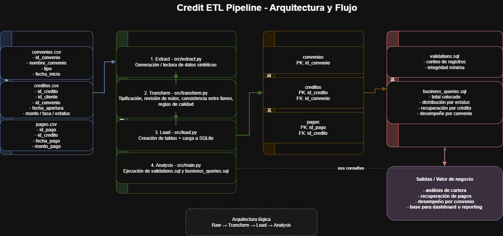

# Credit ETL Pipeline

Pipeline ETL end-to-end que simula un entorno de riesgo crediticio, incluyendo generación de datos, modelado relacional y análisis SQL orientado a negocio.

## Objetivo

Desarrollar un flujo reproducible de datos que permita simular un escenario de análisis crediticio, desde la generación de información hasta la ejecución de consultas de negocio sobre cartera, pagos y convenios.

Este proyecto busca mostrar habilidades en:

- Construcción de pipelines ETL con Python
- Modelado relacional para análisis financiero
- Ejecución de consultas SQL orientadas a negocio
- Organización de proyectos reproducibles para portafolio técnico

## Arquitectura del pipeline



### Interpretación del flujo

El pipeline simula un proceso típico en entornos financieros donde la información de créditos y pagos se integra para su análisis.

El flujo permite:

- Centralizar datos de originación y pagos
- Evaluar el comportamiento de la cartera
- Analizar desempeño por tipo de convenio
- Identificar posibles riesgos en la recuperación

Este tipo de arquitectura es común en áreas de:

- Riesgo crediticio  
- Finanzas  
- Business Intelligence  


## Alcance del proyecto

El pipeline parte de datos sintéticos y construye un flujo simple pero funcional para analizar información de créditos, pagos y convenios.

Incluye:

- Generación de `creditos.csv` con lógica de negocio
- Carga de archivos `.csv` a una base SQLite
- Creación de tablas relacionales mediante SQL
- Validaciones básicas de integridad
- Consultas analíticas para evaluar cartera

## Arquitectura propuesta (escenario real)

Este pipeline puede evolucionar hacia una arquitectura más robusta:

Sources → Raw → Staging → Core → Analytics → BI

Donde:

- Raw: datos sin procesar
- Staging: limpieza y validaciones
- Core: modelo relacional consolidado
- Analytics: métricas y agregaciones
- BI: visualización (Power BI / dashboards)
## Cómo ejecutar el proyecto

### 2. Generar datos
```bash
python src/extract.py
```

### 3. Cargar datos en SQLite
```bash
python src/load.py
```

### 4. Ejecutar validaciones y consultas de negocio
```bash
python src/main.py
```

---

## Validaciones incluidas

El proyecto incluye validaciones básicas para verificar:

- conteo de registros por tabla  
- integridad mínima de la carga  
- funcionamiento de consultas SQL  

---

## Decisiones de diseño

### Uso de SQLite
Se eligió SQLite para facilitar la ejecución local del proyecto y evitar dependencias adicionales en entorno de portafolio.

### Separación de SQL y Python
El SQL se mantiene en archivos `.sql` separados para:

- mejorar legibilidad  
- mostrar modelado de datos  
- facilitar mantenimiento  
- evidenciar habilidad en SQL  

### Datos sintéticos
Se utilizan datos simulados para evitar exposición de información sensible y construir un caso alineado con riesgo crediticio.

---

## Próximas mejoras

- robustecer `transform.py`  
- agregar validaciones de calidad más completas  
- incorporar métricas de morosidad  
- agregar visualización en Power BI o notebooks  
- escalar el pipeline hacia SQL Server o PostgreSQL  
- incluir diagrama del flujo ETL  

---
## Impacto de negocio

Este pipeline permite simular un escenario real de análisis de cartera crediticia, facilitando:

- Identificación de créditos con bajo nivel de recuperación
- Análisis de desempeño por tipo de convenio (gobierno vs empresa)
- Evaluación de distribución de cartera por estatus (activo, vencido, liquidado)
- Seguimiento del monto colocado y comportamiento de pagos

Este tipo de análisis es clave para áreas de:

- Riesgo crediticio
- Finanzas
- Planeación comercial

El modelo permite responder preguntas como:

- ¿Qué porcentaje de la cartera está en riesgo?
- ¿Qué convenios generan mayor colocación?
- ¿Cuál es el nivel de recuperación por crédito?
## Conclusión

Este proyecto muestra una implementación funcional de un pipeline ETL aplicado a un caso de riesgo crediticio, integrando generación de datos, modelado relacional, carga automatizada y consultas analíticas de negocio.


